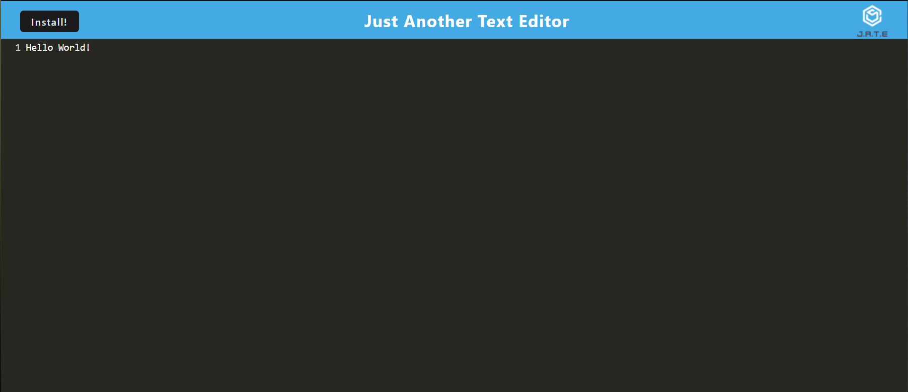

# Text-Editor-C15

## Description

Welcome to J.A.T.E! This is an offline text editor that can be installed onto your computer. 

## Table of Contents
- [Usage](#usage)
- [Installation](#installation)
- [Credits & Contributions](#contributions)
- [Tests](#tests)
- [Questions](#questions)
- [License](#license)

## Usage

This is meant to be a simple offline text editor.

[Heroku](https://shrouded-sea-29075-27f9175162f7.herokuapp.com)

## Installation

Node

## Credits & Contributions

Faith Fechser

## Tests

n/a

## Questions

For any questions, feel free to contact me:

GitHub: [faithfechser](https://github.com/faithfechser)

Email: faithfechser@gmail.com

## License

This application is covered under the MIT license.